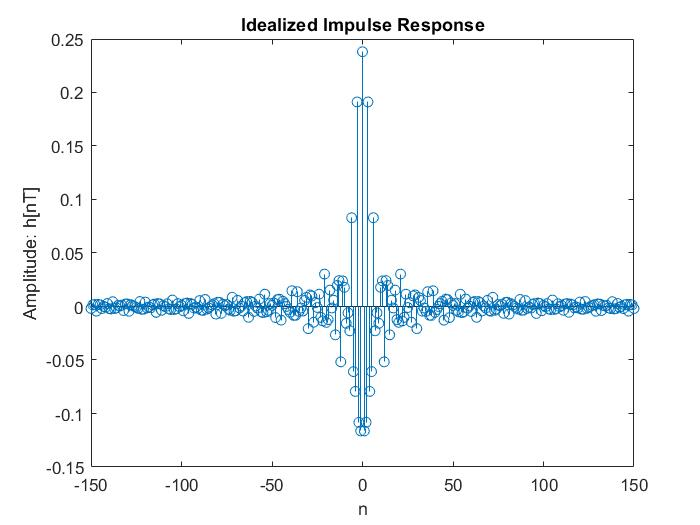
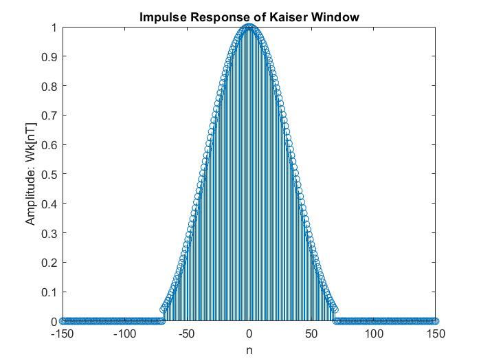
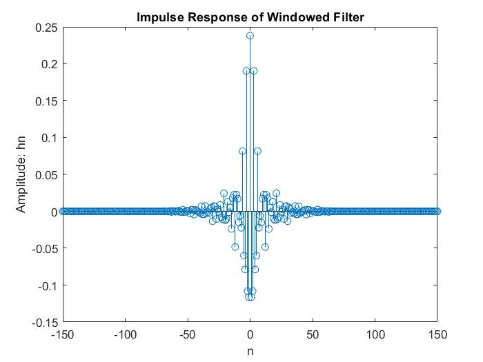
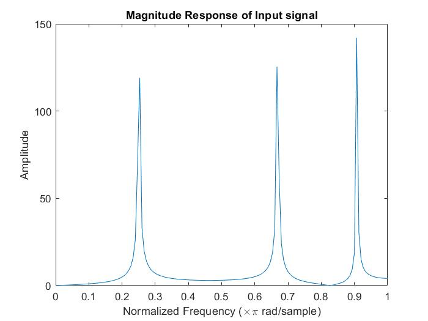
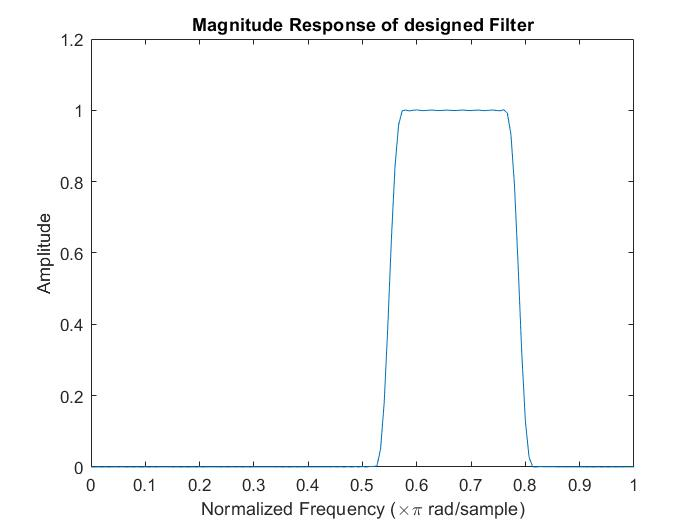
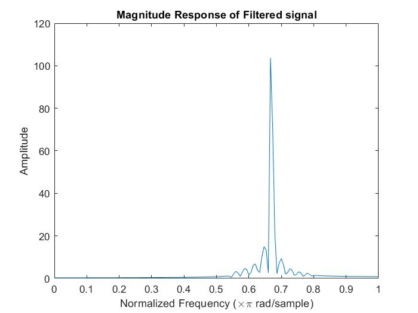

# FIR-Band-Pass-Filter-Design-using-Kaiser-Window

This project is based on the design of FIR digital filters. In here, it will focus on the process of designing a non-recursive Bandpass Filter for given specifications using the windowing method in conjunction with the Kaiser Window. I have used `MATLAB R2018a` for implementing the necessary steps in obtaining time-domain and frequency domain responses. 

You can define the parameters A, B, and C according to your wish and run the code and obtain the results of the design process.

     
